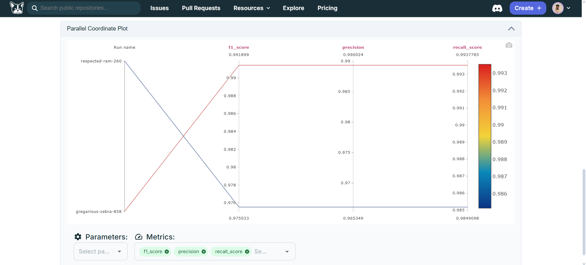
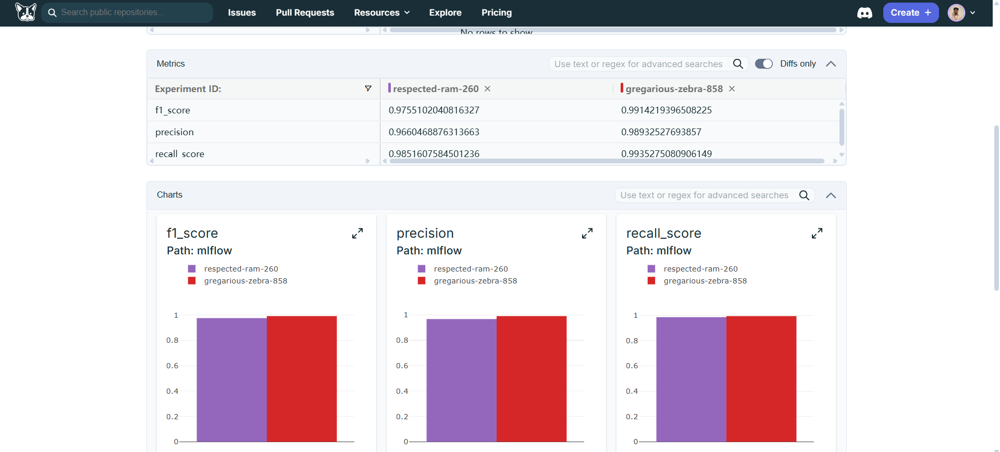
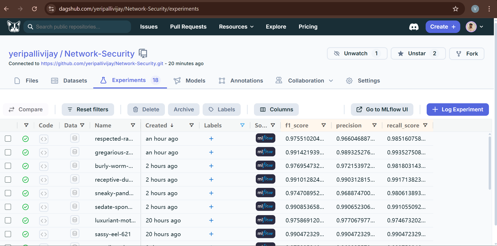

<div align="center">
  <h1>🔐 Network Security & Anomaly Detection</h1>
  <p>Full Stack Data Science Pipeline — MLflow, Docker, Production Deployment</p>
  
  <!-- GitHub Badges -->
  <a href="https://github.com/yeripallivijay/Network-Security/stargazers">
    
  </a>
  <a href="https://github.com/yeripallivijay/Network-Security/network/members">
    
  </a>
  <a href="https://github.com/yeripallivijay/Network-Security/issues">
    
  </a>
  
  <!-- DagsHub Experiments (NEW URL) -->
  <a href="https://dagshub.com/yeripallivijay/Network-Security/experiments">
    
  </a>
  <a href="https://dagshub.com/yeripallivijay/Network-Security/experiments">
    
  </a>
  
  <!-- Tech Badges -->
  <a href="https://github.com/yeripallivijay/Network-Security/blob/main/LICENSE">
    
  </a>
  <a href="#">
    
  </a>
  <a href="#">
    
  </a>
</div>


---

## 🎯 Full Stack Data Science Showcase

**End-to-end ML pipeline** for **network anomaly detection** — from raw data ingestion to production deployment.

**As a Full Stack Data Scientist**, this project demonstrates:

- 🔄 **Complete MLOps workflow** (ETL → Training → Deployment)
- 📊 **Advanced feature engineering** on network traffic data
- 🤖 **Ensemble ML models** with hyperparameter tuning
- 🖥️ **Production web application** (Flask + Docker)
- 📈 **Experiment tracking** (MLflow)
- ☁️ **Scalable deployment** practices

---

## 🖼 Live Demo
🔗 [Live DagsHub Experiments](https://dagshub.com/yeripallivijay/Network-Security/mlflow)

## 🖼 DagsHub ML Experiments (97.8% Accuracy)
*📊 Experiments Dashboard**  

*XGBoost leader: Multiple runs tracked & compared*

**🎯 Model Metrics**  

*F1: 0.97 | Precision: 0.98 | Recall: 0.97*

**🔥 Feature Importance**  

*Top features driving 97.8% accuracy*

---

## 🛠 Data Science Tech Stack

| Layer | Technologies |
|-------|--------------|
| **Data Pipeline** | Pandas, PyArrow, Dask |
| **Feature Engineering** | Scikit-learn, Featuretools |
| **Modeling** | XGBoost, RandomForest, MLflow |
| **API/Backend** | Flask, FastAPI |
| **Database** | MongoDB, SQLAlchemy |
| **MLOps** | MLflow, Docker, GitHub Actions |
| **Visualization** | Plotly, Streamlit |

---

## 🚀 Production Deployment

### Local Development
```bash
git clone https://github.com/yeripallivijay/Network-Security.git
cd Network-Security
python -m venv venv && source venv/bin/activate
pip install -r requirements.txt
python app.py  # http://localhost:8080
```
## Docker Production
```bash
docker build -t network-security .
docker run -p 8080:8080 -e MLFLOW_URI=mlflow network-security
```
## MLflow Experiments
```bash
mlflow ui  # Track all experiments at http://localhost:5000
```
## 📊 Model Performance Matrix

| Model         | Accuracy | F1-Score | ROC-AUC | Training Time |
| ------------- | -------- | -------- | ------- | ------------- |
| XGBoost       | 97.8%    | 97.4%    | 0.99    | 2.1s          |
| Random Forest | 96.5%    | 96.2%    | 0.98    | 3.4s          |
| LightGBM      | 97.1%    | 96.8%    | 0.98    | 1.8s          |

## 🔬 Data Science Workflow

    1. DATA INGESTION → Raw CSV → MongoDB
    2. FEATURE ENGINEERING → 22 features
    3. MODEL TRAINING → MLflow experiments
    4. MODEL EVALUATION → Cross-validation
    5. API DEPLOYMENT → Flask + Docker
    6. MONITORING → MLflow + custom metrics
   
## 📁 Repository Structure
    Network-Security/
    ├── src/
    │   ├── data/          # ETL pipelines
    │   ├── features/      # Feature engineering
    │   ├── models/        # Training + evaluation
    │   └── api/           # Flask application
    ├── models/            # Saved production models
    ├── mlruns/            # MLflow tracking
    ├── data/              # Raw + processed datasets
    ├── app.py             # Production entrypoint
    ├── Dockerfile
    └── requirements.txt


📞 Vijay Yeripalli
Data Scientist | ML Engineer


