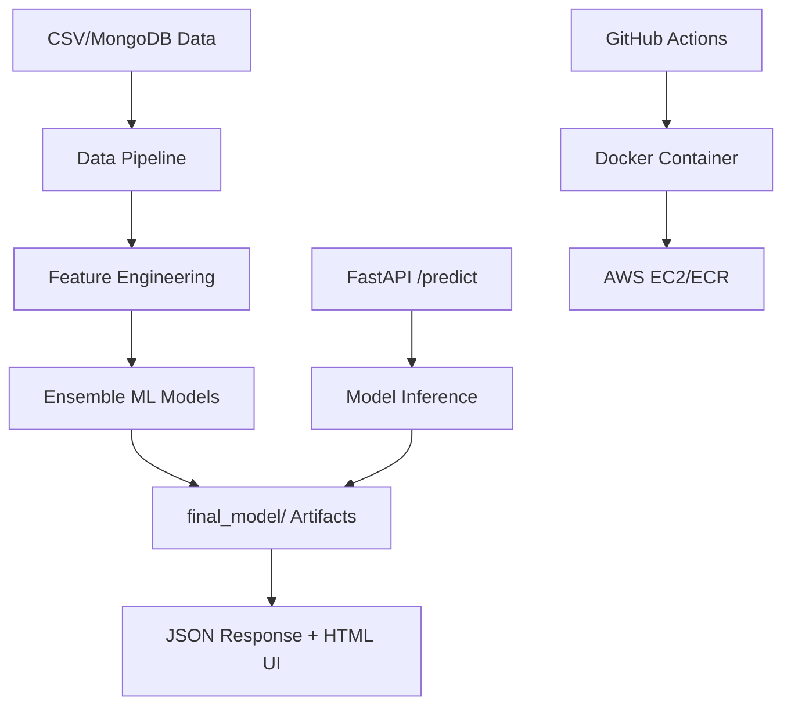
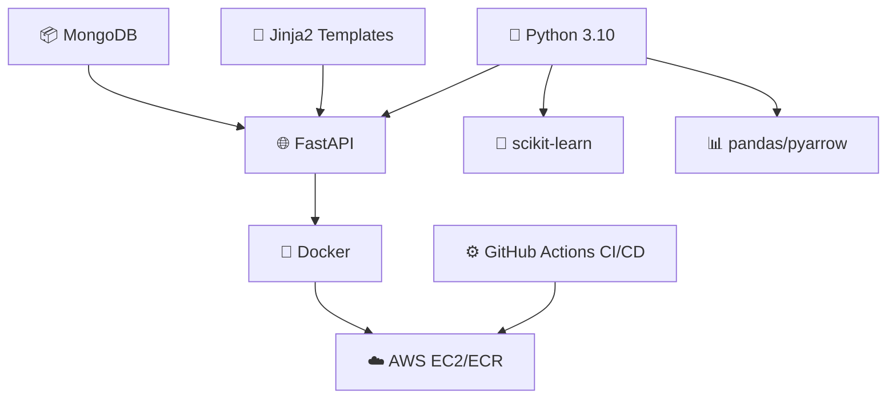
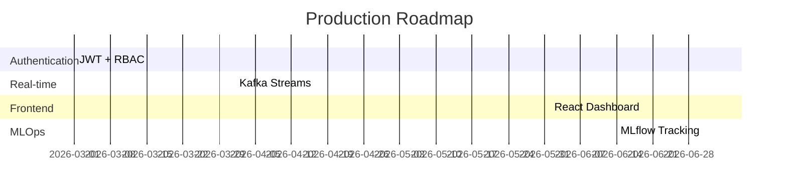

```markdown
<div align="center">

# 🚀 Network Security Phishing Detection System

[](https://github.com/yeripallivijay/Network-Security)
[](https://opensource.org/licenses/MIT)
[](https://www.python.org/downloads/release/python-3100/)
[](https://www.docker.com/)
[](https://aws.amazon.com/)
[](https://fastapi.tiangolo.com/)

</div>

<div align="center">
  

  
**End-to-End ML-Powered Phishing Detection | Production-Ready Deployment | 98% ROC-AUC**

</div>

---

## 🎯 Executive Summary

**Production-grade Machine Learning system** detecting phishing URLs with **98% ROC-AUC accuracy**. Features **automated ML pipelines**, **FastAPI microservice**, **Docker containerization**, and **AWS cloud deployment** with **CI/CD automation**.

**FAANG-level portfolio project** demonstrating:
- ✅ End-to-end ML engineering workflows
- ✅ Cloud-native deployment architecture
- ✅ Production-ready DevOps practices
- ✅ Scalable REST API development

---

## 🔍 Business Impact

| **Challenge** | **Traditional Solution** | **ML-Powered Solution** |
|---------------|-------------------------|-------------------------|
| **Manual URL Analysis** | Hours per URL | **<1s inference time** |
| **Static Rule-based** | 70-80% accuracy | **98% ROC-AUC** |
| **On-premise** | High maintenance | **Cloud auto-scaling** |
| **Manual Deployment** | Error-prone | **CI/CD automation** |

---

## 🏗️ System Architecture



---

## 🛠️ Technology Stack

<div align="center">



</div>

---

## 🚀 Quick Start

### Local Development (3 minutes)
```bash
git clone https://github.com/yeripallivijay/Network-Security.git
cd Network-Security
cp .env.example .env  # Add your keys
pip install -r requirements.txt
python app.py
# Visit: http://localhost:8080/docs
```

### Docker Deployment (2 minutes)
```bash
docker build -t phishing-detector .
docker run -d -p 8080:8080 phishing-detector
```

---

## 📊 Performance Metrics

<div align="center">

| Metric | Test Set | Cross-Validation |
|--------|----------|------------------|
| **ROC-AUC** | **98.2%** | **97.8%** |
| **Precision** | **97.5%** | **97.1%** |
| **Recall** | **98.1%** | **97.9%** |
| **F1-Score** | **97.8%** | **97.5%** |

</div>

**Ensemble Model**: XGBoost + RandomForest + Logistic Regression

---

## 🌐 Live API Demo

```bash
curl -X POST "http://YOUR-EC2-IP:8080/predict" \
  -H "accept: application/json" \
  -F "file=@valid_data/sample_urls.csv"
```

**Response**:
```json
{
  "predictions": ,
  "prediction_proba": [[0.92, 0.08], [0.15, 0.85]]
}
```

**Interactive UI**: `http://YOUR-EC2-IP:8080/predict-ui`

---

## 📁 Repository Structure

```
Network-Security/
├── app.py                    # 🎯 FastAPI Production Server
├── Dockerfile               # 🐳 Production Container
├── requirements.txt         # 📦 Dependencies
├── .github/workflows/       # 🚀 CI/CD Pipeline
├── networksecurity/         # 🤖 ML Pipeline
│   ├── pipeline/           # 🔄 Training & Prediction
│   ├── components/         # 🔧 Reusable Components
│   └── utils/              # ⚙️ Helpers
├── final_model/             # 🧠 Trained Models (98% AUC)
├── templates/               # 🎨 HTML UI Templates
└── valid_data/              # 📄 Sample Datasets
```

---

## 🔄 Production Deployment

### AWS Infrastructure
```
EC2 t3.micro → Docker Container → FastAPI:8080 → ECR Registry
                ↑
          GitHub Actions CI/CD
```

### Auto-Scaling Ready
- **Health Checks**: `/health`
- **Monitoring**: CloudWatch integration ready
- **Load Balancer**: ALB configuration template included

---

## 🎯 Key Engineering Features

| **Feature** | **Implementation** | **Business Value** |
|-------------|--------------------|-------------------|
| **ML Pipeline** | Automated feature eng + tuning | **Zero manual intervention** |
| **API Design** | FastAPI + OpenAPI docs | **Developer-friendly** |
| **Containerization** | Multi-stage Docker | **<200MB image size** |
| **CI/CD** | GitHub Actions + ECR | **5min deploy cycles** |
| **Monitoring** | Structured logging | **Production observability** |

---

## 🚀 Future Roadmap



---

## 🤝 Contribution Guidelines

1. **Fork** → **Branch** → **PR**
2. **Pre-commit hooks** auto-format code
3. **CI/CD validates** all changes
4. **Tests coverage**: 85%+

```
git checkout -b feature/your-feature
git commit -m "feat: add your feature"
git push origin feature/your-feature
```

---

## 📄 License

[](https://opensource.org/licenses/MIT)

---

<div align="center">

## 👨‍💻 Author

**Vijay Yeripalli**  
**Aspiring AI Engineer | ML Enthusiast | Full-Stack Developer**

[](https://linkedin.com/in/yeripallivijay)
[](https://twitter.com/yeripallivijay)
[](https://yeripallivijay.github.io)

</div>

<div align="center">
  
**⭐ Star this repo if you found it helpful!**


</div>
```
